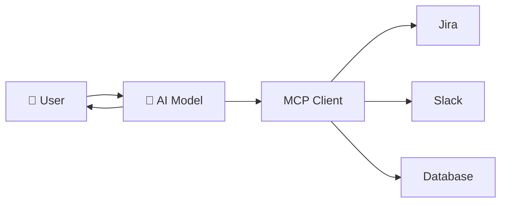
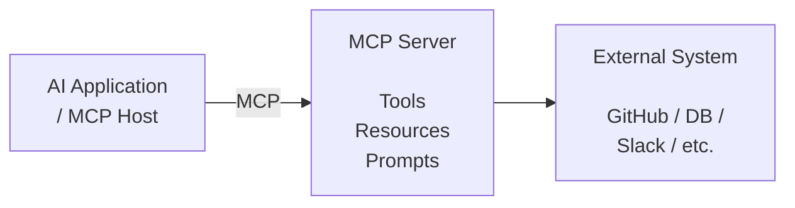
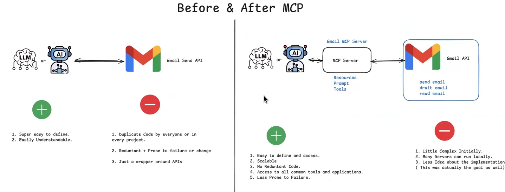
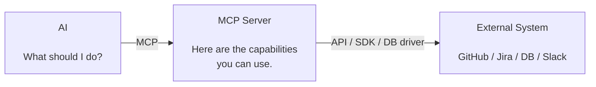

# Model Context Protocol
> MCP is a standardized protocol that gives AI applications a consistent way to discover and use external tools, resources, and prompts, instead of requiring every AI application to build a separate custom integration for every system

[Notes](https://ai-automation-with-mayank.netlify.app/#mcp)

## The problem without MCP
* Imagine you have an AI assistant that needs to work with:
    * GitHub
    * Google Drive
    * Slack
    * A database
    * Company's internal APIs

* Without MCP, the AI application has to build a special integration for every service.
    ```text
                AI
                ├── Custom GitHub integration
                ├── Custom Slack integration
                ├── Custom Jira integration
                ├── Custom Database integration
                └── Custom Google Drive integration
    ```
* And every integration may work differently,The developer has to figure out:
    * How do I tell GitHub what I want?
    * How do I authenticate with Slack?
    * How do I retrieve data from this database?

**Analogy**
* Imagine every electronic device had its own completely different charger
* You need to build/buy a different connection for everything
    ```text
        Phone       → Charger A
        Laptop      → Charger B
        Camera      → Charger C
        Headphones  → Charger D
        Tablet      → Charger E
    ```

## What MCP does
**MCP introduces a common protocol for AI applications to communicate with tools and data.**


* The AI doesn't need to understand every tool's unique integration mechanism.
* The MCP server exposes capabilities in a standardized way.
* MCP is like a standard USB interface for AI applications to connect with external tools and data.

### What actually happens
There are typically three important pieces:


* The MCP server acts as the standardized bridge.
* The important idea is that the AI application doesn't have to implement the entire Tools specific interaction itself.

### Example without MCP
* Suppose you're building an AI coding assistant.
* User asks: "Check GitHub issues and create a Jira ticket for the important ones"
* Without MCP:
    ```text
                    AI Application
                ┌─────────┴─────────┐
                ↓                   ↓
        GitHub integration   Jira integration
                ↓                   ↓
            GitHub API           Jira API
    ```
* Now imagine adding:
    * Slack
    * Database
    * Google Drive and many more.
* You end up with a growing collection of custom integrations.

### Example with MCP
* The AI application has a standard way of interacting with MCP servers.
* Each MCP server handles the specifics of its underlying system.

```text
                    AI Application
                           │
                           ↓ MCP
                 ┌──────────────────┐
                 │   MCP Servers    │
                 └────────┬─────────┘
             ┌────────────┼────────────┐
             ↓            ↓            ↓
        GitHub MCP    Jira MCP     Slack MCP
             ↓            ↓            ↓
          GitHub        Jira         Slack

```



## Takeaway 
**MCP is a standard protocol for exposing tools, resources, and prompts to AI applications**
