# Architecture overview

* MCP follows a client-server architecture.
* The key participants in the MCP architecture are:
    * **MCP Host:** The AI application that coordinates and manages one or multiple MCP clients.
    * **MCP Client:** A component that maintains a connection to an MCP server and obtains context from an MCP server for the MCP host to use.
    * **MCP Server**: A program that provides context to MCP clients.

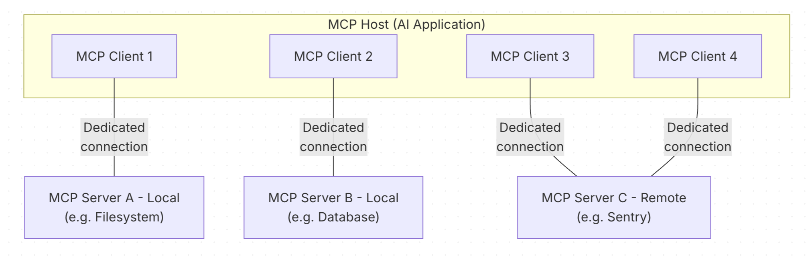

* For example: Visual Studio Code acts as an MCP host. 
* When Visual Studio Code establishes a connection to an MCP server, such as the Database MCP server, the Visual Studio Code runtime instantiates an MCP client object that maintains the connection to the Database MCP server. 
* When Visual Studio Code subsequently connects to another MCP server, such as the local filesystem server, the Visual Studio Code runtime instantiates an additional MCP client object to maintain this connection.

---

## Layers
MCP consists of two layers:

1. **Data layer:** Defines the JSON-RPC based protocol for client-server communication, including version discovery and core primitives, such as `tools`, `resources`, `prompts` and `notifications`.
    * **Why JSON-RPC (Remote procedure call)**
        * **Lightweight** : Plain JSON, human-readable
        * **Transport-agnostic**: Same shape over stdio or HTTP
        * **Two-way by design** — Either side can send a request
        * **Notifications built in** — No id, fires and expects nothing back
2. **Transport layer:** Defines the communication mechanisms and channels that enable data exchange between clients and servers.

### Data layer
Data layer implements a **JSON-RPC 2.0** based exchange protocol that defines the message structure. This includes:
1. **Lifecycle management**: Handles connection initialization, capability negotiation, and connection termination between clients and servers.
2. **Server features**: Enables servers to provide core functionality like tools for AI, resources for context, and prompts for templates from and to the client.
3. **Client features**: Enables servers to ask the client to sample from the host LLM, elicit input from the user, and log messages to the client.
4. **Utility features**: Supports additional capabilities like notifications for real-time updates and progress tracking for long-running operations.

### Transport layer
The transport layer manages communication channels and authentication between clients and servers, It supports two transport mechanisms:
1. **Stdio transport**: Uses standard input/output streams for direct process communication between local processes on the same machine, providing optimal performance with no network overhead.
    * The client launches the MCP server as a subprocess.
    * The server reads JSON-RPC messages from its standard input (stdin) and sends messages to its standard output (stdout).
    * Messages are individual JSON-RPC requests, notifications, or responses.
    * Messages are delimited by newlines, and MUST NOT contain embedded newlines.
    * The server MUST NOT write anything to its stdout that is not a valid MCP message.
    * The client MUST NOT write anything to the server’s stdin that is not a valid MCP message.
2. **Streamable HTTP transport**: 
    * Uses **HTTP POST** for client-to-server messages with optional **Server-Sent Events** for streaming capabilities. 
    * This transport supports HTTP authentication methods including bearer tokens, API keys, and custom headers. 
    * MCP recommends using OAuth to obtain authentication tokens.
    * The server MUST provide a single HTTP endpoint path that supports both POST and GET methods, this could be a URL like https://example.com/mcp.
    * The client MUST use HTTP POST to send JSON-RPC messages to the MCP endpoint.
    * The client MUST include an Accept header, listing both application/json and text/event-stream as supported content types.

--- 

## Data Layer Protocol

**Primitives**

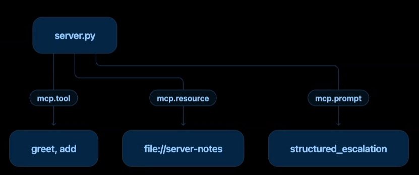

MCP primitives define what clients and servers can offer each other.
1. **Server Exposed Primitives:**
    1. **Tools**: Executable functions that AI applications can invoke to perform actions (e.g., API calls, database queries)
    2. **Resources**: Data sources that provide contextual information to AI applications (e.g., file contents, database records)
    3. **Prompts**: Reusable templates that help structure interactions with language models (e.g., system prompts, few-shot examples)

    > Each primitive type has associated methods for discovery `(*/list)`, retrieval `(*/get)`, and in some cases, execution (tools/call). <br>MCP clients will use the `*/list` methods to discover available primitives. <br>For example, a client can first list all available tools (tools/list) and then execute them.
2. **Client Exposed Primitives:**
    * **Sampling**: 
        * Allows servers to request language model completions from the client’s AI application. 
        * This is useful when server authors want access to a language model, using the `sampling/createMessage` method to request a LLM from the client’s AI application
    * **Elicitation**: 
        * Allows servers to request additional information from users.
        * This is useful when server authors want to get more information from the user, or ask for confirmation of an action.
        * They can use the `elicitation/create` method to request additional information from the user.
    * **Logging**: Enables servers to send log messages to clients for debugging and monitoring purposes.

---

## MCP Lifecycle

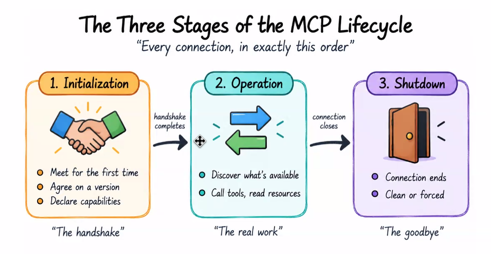

### 1. Initialization - The Handshake
MCP begins with capability negotiation handshake. Three steps every time
1. The client speaks first, sending exactly three things.
    ```json
        {
            "jsonrpc": "2.0", "id": 1, "method": "initialize",
            "params": {
                "protocolVersion": "2025-11-25",
                "capabilities": { "roots": { "listChanged": true } },
                "clientInfo": { "name": "RecipeBoxDesktopClient", "version": "1.0.0" }
            }
        }
    ```
2. The server answers, matching the same id, with its own three things.
    ```json
        {
            "jsonrpc": "2.0", "id": 1,
            "result": {
                "protocolVersion": "2025-11-25",
                "capabilities": { "tools": { "listChanged": true } },
                "serverInfo": { "name": "RecipeBox", "version": "1.0.0" }
            }
        }
    ```
3. The client seals the handshake with a notification — no reply expected.
    ```json
        { "jsonrpc": "2.0", "method": "notifications/initialized" }
    ```        

* The initialization process serves several critical purposes:
    1. **Protocol Version Negotiation**: The `protocolVersion` field (e.g., “2025-11-25”) ensures both client and server are using compatible protocol versions, If a mutually compatible version is not negotiated, the connection should be terminated.
        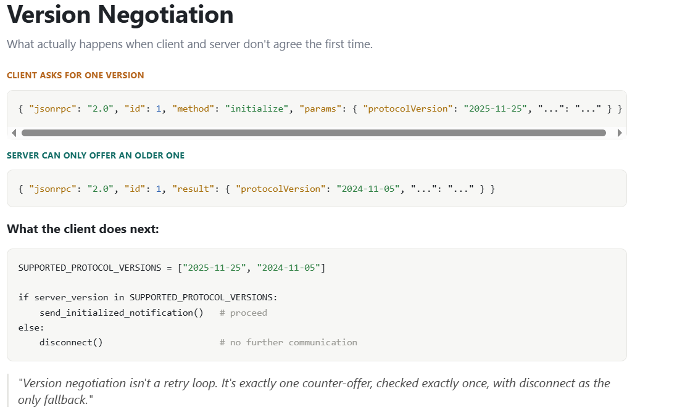
    2. **Capability Discovery**: The `capabilities` object allows to declare what features they support, including which primitives they can handle (tools, resources, prompts).
        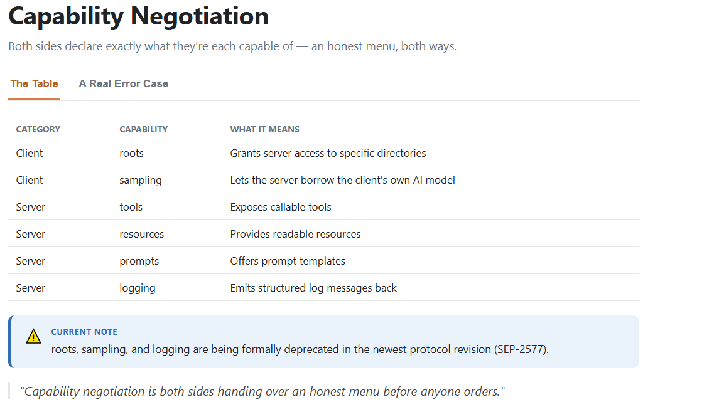

    
    3. **Identity Exchange**: The `clientInfo` and `serverInfo` objects provide identification and versioning information for debugging and compatibility purposes.

    <details>
    <summary><b>Initialize Request</b></summary>
        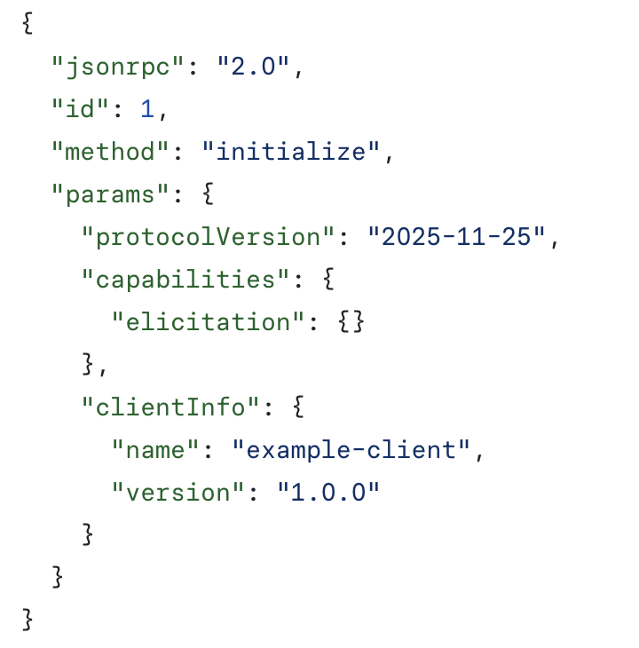
    </details>

    <details>
    <summary><b>Initialize Response</b></summary>
            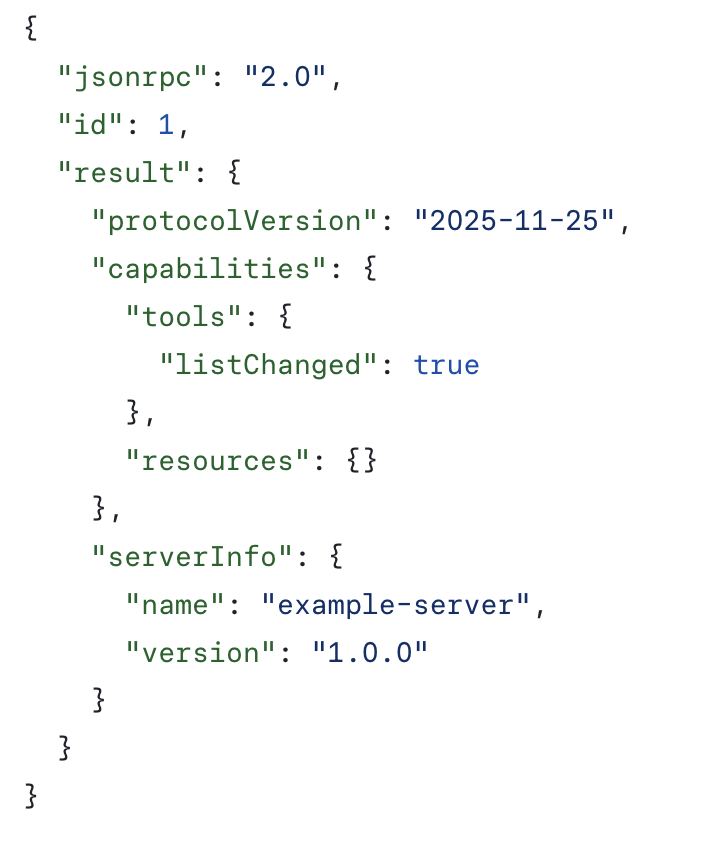
    </details>

### 2. Operation 
1. Tool Discovery (Primitives)
    * Now that the connection is established, the client can discover available tools by sending a `tools/list` request.
    * It allows clients to understand what tools are available on the server before attempting to use them.
    
    <details>
    <summary><b>Tool List Request</b>: The tools/list request is simple, containing no parameters.</summary>
        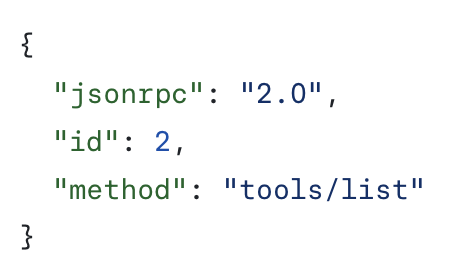
    </details>

    <details>
    <summary><b>Tool List Response</b>: Contains tools array providing metadata about available tools.</summary>
            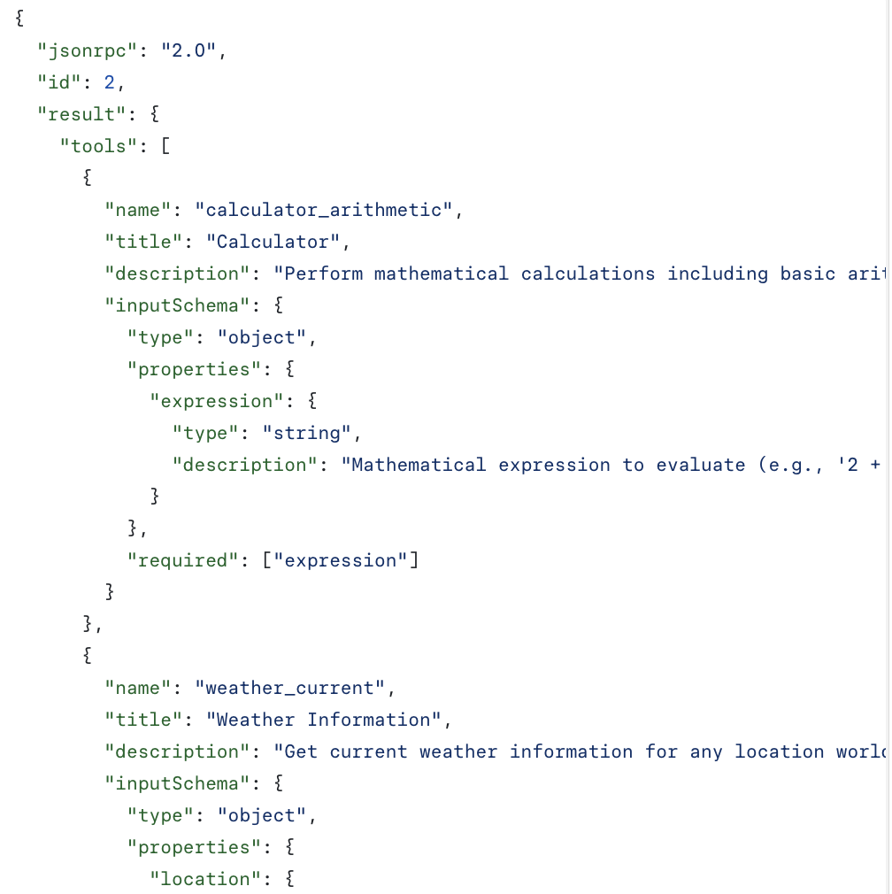
    </details>

    **Each tool object in the response includes several key fields**
    * `name`: This serves as the primary key for tool execution and should follow a naming pattern.
    * `title`: A human-readable display name for the tool that clients can show to users
    * `description`: Detailed explanation of what the tool does and when to use it
    * `inputSchema`: A JSON Schema that defines the expected input parameters providing clear documentation about required and optional parameters.

        ```python
        # Pseudo-code using MCP Python SDK patterns
        available_tools = []
        for session in app.mcp_server_sessions():
            tools_response = await session.list_tools()
            available_tools.extend(tools_response.tools)
        conversation.register_available_tools(available_tools)
        ```
2. **Tool Execution / Tool Calls (Primitives)**
* The client can now execute a tool using the `tools/call` method. 
* After discovering available tools, the client can invoke them with appropriate arguments.

    <details>
    <summary><b>Tool Call Request</b>: Using the tool name from the discovery response (weather_current).</summary>
        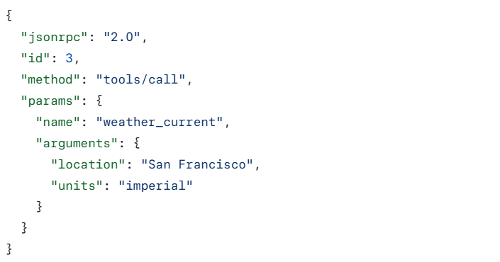
    </details>

    <details>
    <summary><b>Tool Call Response</b>: Contains tools array providing metadata about available tools.</summary>
            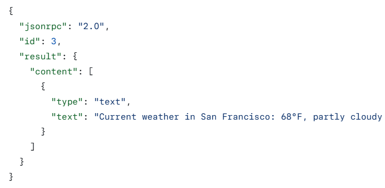
    </details>

    **Request structure**
    * `name`: Must match exactly the tool name from the discovery response (weather_current).
    * `arguments`: Contains the input parameters as defined by the tool’s inputSchema.
    * `JSON-RPC Structure`: Uses standard JSON-RPC 2.0 format with unique id for request-response correlation.

    **Response structure**
    * `content` Array: Tool responses return an array of content objects, allowing for, multi-format responses (text, images, resources, etc.)
    * `Content Types`: Each content object has a type field. In this example, "type": "text" indicates plain text content.
        ```python
        # Pseudo-code for AI application tool execution
        async def handle_tool_call(conversation, tool_name, arguments):
            session = app.find_mcp_session_for_tool(tool_name)
            result = await session.call_tool(tool_name, arguments)
            conversation.add_tool_result(result.content)
        ```
#### Real-time Updates (Notifications)
* MCP supports real-time notifications that enable servers to inform clients about changes without being explicitly requested. 
* When the server’s available tools change, such as when new functionality becomes available, existing tools are modified, or tools become temporarily unavailable, the server can proactively notify connected clients
```json
    {
        "jsonrpc": "2.0",
        "method": "notifications/tools/list_changed"
    }
```
**Key Features of MCP Notifications**
1. No Response Required: There’s no id field in the notification. This follows JSON-RPC 2.0 notification semantics where no response is expected or sent.
2. Capability-Based: This notification is only sent by servers that declared "`listChanged`": true in their tools capability during initialization.
3. Event-Driven: The server decides when to send notifications based on internal state changes, making MCP connections dynamic and responsive.

**Client Response to Notifications**
* Upon receiving this notification, the client typically reacts by requesting the updated tool list. 
* This creates a refresh cycle that keeps the client’s understanding of available tools
```json
    {
        "jsonrpc": "2.0",
        "id": 4,
        "method": "tools/list"
    }
```
```python
    # Pseudo-code for AI application notification handling
    async def handle_tools_changed_notification(session):
        tools_response = await session.list_tools()
        app.update_available_tools(session, tools_response.tools)
        if app.conversation.is_active():
            app.conversation.notify_llm_of_new_capabilities()
```
### 3. Shutdown:
* The one phase with no message format of its own.
* No JSON-RPC message is exchanged during shutdown at all. The entire responsibility shifts to the transport layer.

| Transport | Client-initiated (common) | Server-initiated (rare) |
|---|---|---|
| **stdio** | Close stdin, wait; `SIGTERM` if it doesn't; `SIGKILL` as a last resort | Server closes its output stream and exits |
| **Streamable HTTP** | Close the HTTP connection | Server closes unexpectedly — client should reconnect gracefully |

## Error Handling
***6 Scenarios***
1. Protocol version mismatch during initialization
2. Calling a method never negotiated
3. Invalid arguments to a real tool
4. An internal failure on the server's side
5. A timeout being exceeded
6. A syntactically malformed JSON-RPC message

Example
```json
{
    "jsonrpc": "2.0", "id": 4, 
    "error": {
        "code": -32602, "message": "Unsupported protocol version",
        "data": {
            "supported": ["2025-11-25"], "requested": "1.0.0"
        }
    }
}
```

## Error Codes
The following error codes are used to indicate different types of request or server failures.
| Code | Name | Cause |
|---:|---|---|
| `-32700` | Parse error | Unreadable JSON |
| `-32600` | Invalid request | Well-formed, but not valid |
| `-32601` | Method not found | Method was never advertised |
| `-32602` | Invalid params | Wrong or missing arguments |
| `-32603` | Internal error | Server-side logic failed |
| `-32000+` | Server-defined | Custom error defined by the server |
