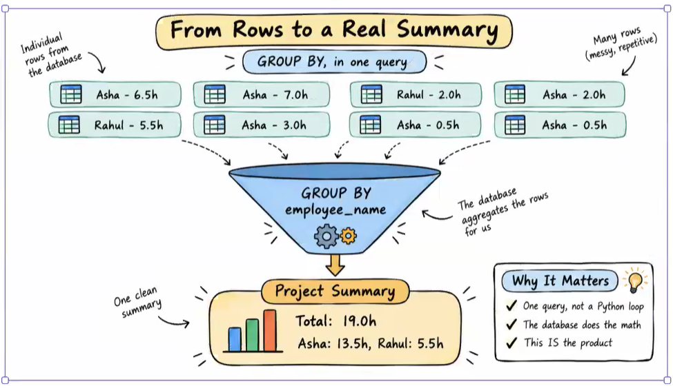
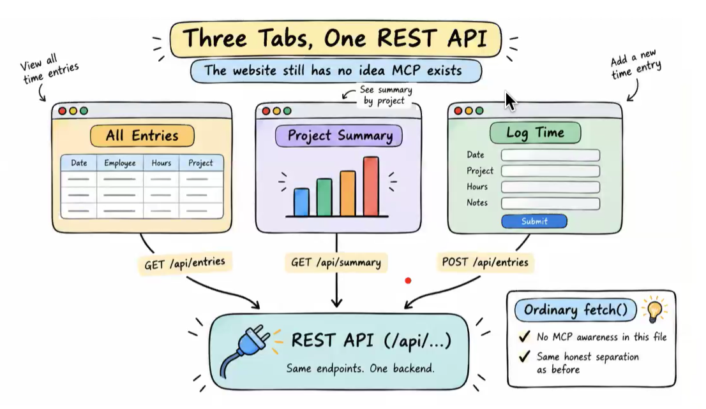
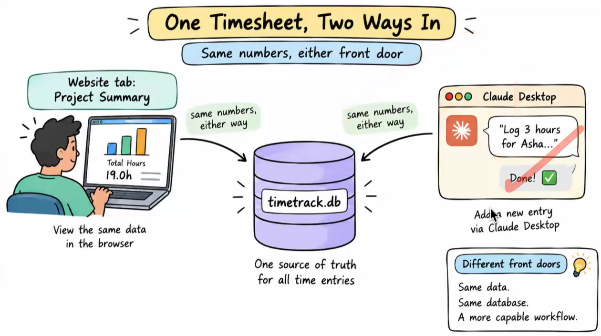
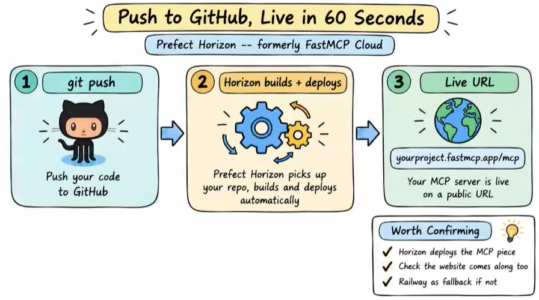
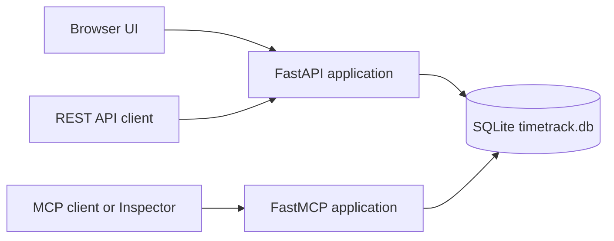

# Time Track Application
### Project Summary with SQL `GROUP BY`


- Time entries begin as individual database rows containing an employee and logged hours.
- A SQL `GROUP BY employee_name` query aggregates those rows for a selected project.
- The database calculates each employee’s total and the overall project total in one query.
- The resulting summary is ready for the REST API, website dashboard, or MCP tool without Python-side aggregation.

### Three Website Tabs, One REST API


- The **All Entries** tab fetches and displays recorded time entries with `GET /api/entries`.
- The **Project Summary** tab requests project-level totals from the REST API.
- The **Log Time** tab sends a new record through `POST /api/entries`.
- The frontend uses ordinary browser `fetch()` calls and does not need MCP-specific code.

### One Timesheet, Two Interfaces


- The browser application and MCP client are separate interfaces to the same TimeTrack service.
- Both paths read and write to the same `timetrack.db` SQLite database.
- Time entered through an MCP client is immediately available in the web UI.
- This shared persistence layer keeps all time records consistent regardless of the interface used.

### Deploying with Prefect Horizon


- Push the TimeTrack repository to GitHub.
- Connect the repository to Prefect Horizon, which builds and deploys the MCP server.
- The deployment provides a public MCP URL, such as `https://your-project.fastmcp.app/mcp`.
- Confirm whether the deployment also serves the FastAPI website; use a general application host such as Railway when both the website and MCP server must be public.


`main.py` starts a single web application that exposes two interfaces backed by the same SQLite database:

1. A **FastAPI application** for the browser-based timesheet UI and REST API.
2. A **FastMCP server** for AI assistants that communicate using the MCP Streamable HTTP transport.

Both interfaces call the same functions from `database.py`. A time entry created through the website is therefore immediately available through MCP, and vice versa.



### Application startup

At import time, the application defines the static-files directory relative to `main.py`:

```python
STATIC_DIR = Path(__file__).parent / "static"
```

This makes the frontend work even when Uvicorn is started from the repository root.

It then initializes the SQLite database:

```python
db.init_db()
```

`init_db()` creates the `time_entries` table when it does not exist and adds sample records the first time the database is created.

### MCP server

The MCP server is created with:

```python
mcp = FastMCP("TimeTrack")
```

It exposes the following capabilities:

| MCP type | Name | Purpose |
| --- | --- | --- |
| Tool | `log_time` | Creates a time entry for an employee and project. |
| Tool | `get_timesheet` | Retrieves one employee's entries, optionally within a date range. |
| Tool | `get_project_summary` | Returns a project's total hours and hours grouped by employee. |
| Tool | `list_projects` | Lists projects that have recorded time entries. |
| Resource | `timesheet://projects` | Provides the current project names. |
| Prompt | `generate_weekly_report` | Gives an AI assistant a workflow for producing a weekly report. |

The server is converted to an ASGI application with:

```python
mcp_app = mcp.http_app(path="/")
```

The path must remain `"/"` because FastAPI adds the public `/mcp` prefix when it mounts `mcp_app`:

```python
app.mount("/mcp", mcp_app)
```

Together, these produce the MCP endpoint:

```text
http://127.0.0.1:8000/mcp/
```

The MCP lifespan is passed when creating FastAPI so FastMCP can initialize and close its session manager correctly:

```python
app = FastAPI(title="TimeTrack", lifespan=mcp_app.lifespan)
```

### FastAPI routes

| Method | Route | Purpose |
| --- | --- | --- |
| `GET` | `/` | Returns the timesheet web application. |
| `GET` | `/api/entries` | Returns every time entry. |
| `POST` | `/api/entries` | Creates a new time entry. |
| `GET` | `/api/projects` | Lists all projects. |
| `GET` | `/api/projects/{project}/summary` | Returns totals for a single project. |
| `GET` | `/api/timesheet/{employee_name}` | Returns entries for an employee; accepts optional `start_date` and `end_date` query parameters. |
| `GET` | `/static/...` | Serves CSS, JavaScript, and other frontend assets. |
| MCP | `/mcp/` | FastMCP Streamable HTTP endpoint for MCP clients. |

FastAPI automatically provides interactive REST documentation at:

```text
http://127.0.0.1:8000/docs
```

### Running the application

From the repository root, run:

```powershell
uv run uvicorn main:app --app-dir .\src\02_time_track_project --reload
```

Or, using the project's virtual environment directly:

```powershell
.\.venv\Scripts\python.exe -m uvicorn main:app --app-dir .\src\02_time_track_project --reload
```

After startup, use these URLs:

| Interface | URL |
| --- | --- |
| Timesheet web UI | `http://127.0.0.1:8000/` |
| FastAPI OpenAPI documentation | `http://127.0.0.1:8000/docs` |
| FastMCP endpoint | `http://127.0.0.1:8000/mcp/` |

### Testing the MCP endpoint

The MCP endpoint is not a normal web page. Opening it directly in a browser can result in:

```text
400 Bad Request
```

This is expected because the browser sends an ordinary HTTP request rather than an MCP protocol request.

Use the MCP Inspector instead:

```powershell
npx @modelcontextprotocol/inspector --transport streamable-http --server-url http://127.0.0.1:8000/mcp/
```

For an MCP client configuration, use:

```json
{
  "mcpServers": {
    "timetrack": {
      "url": "http://127.0.0.1:8000/mcp/"
    }
  }
}
```